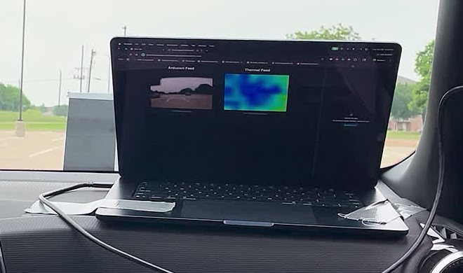
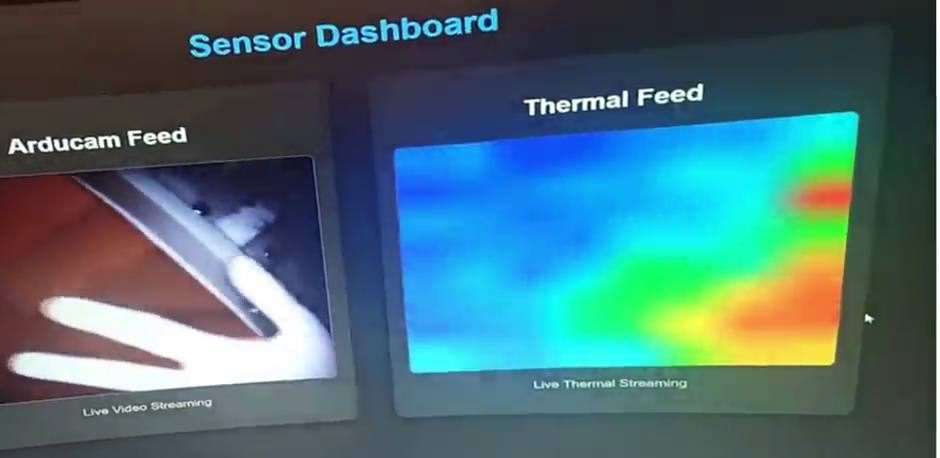
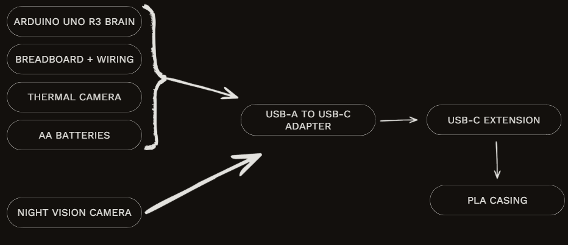
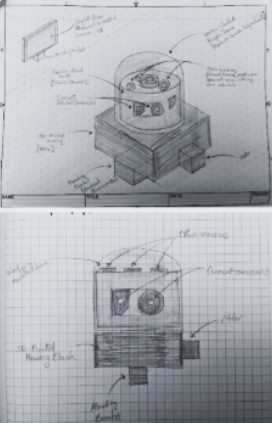
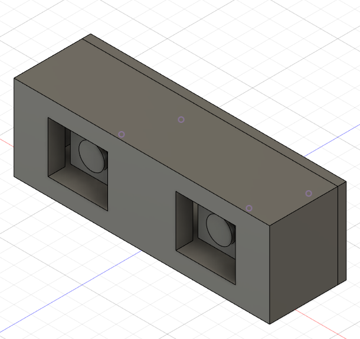
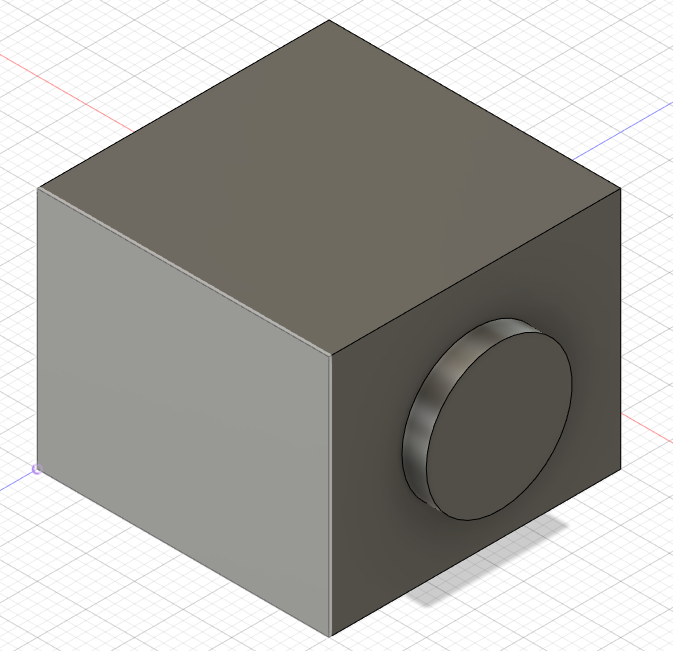
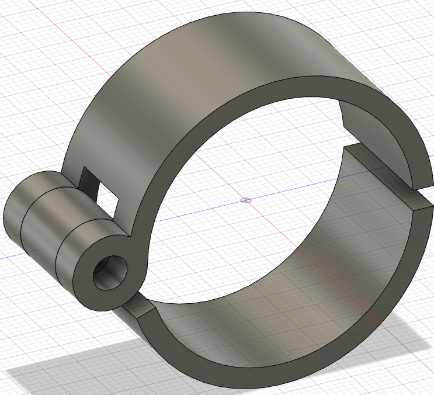
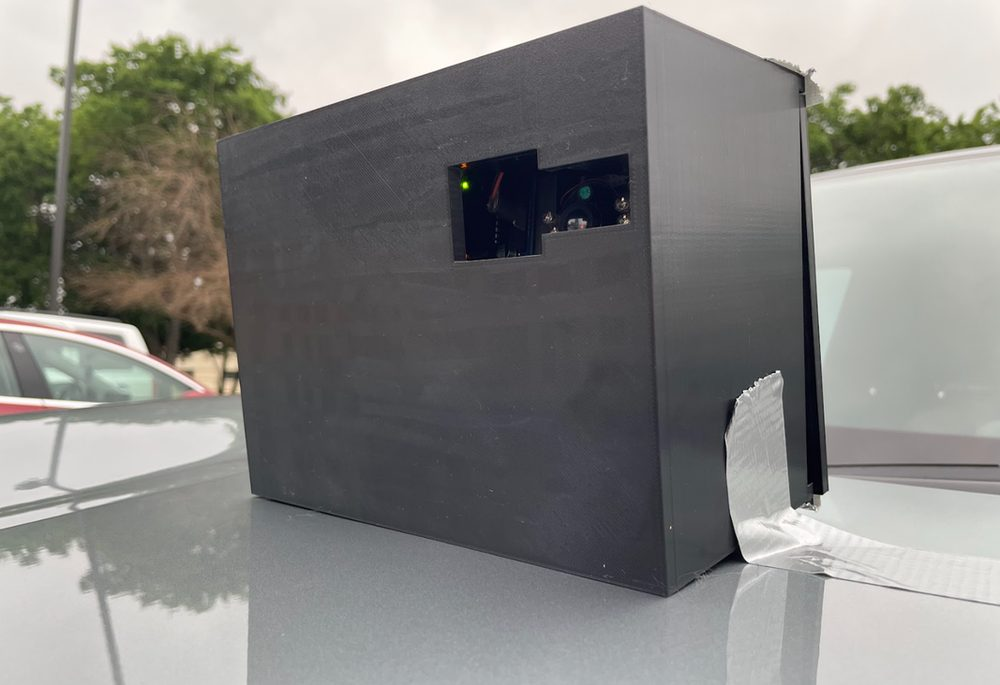
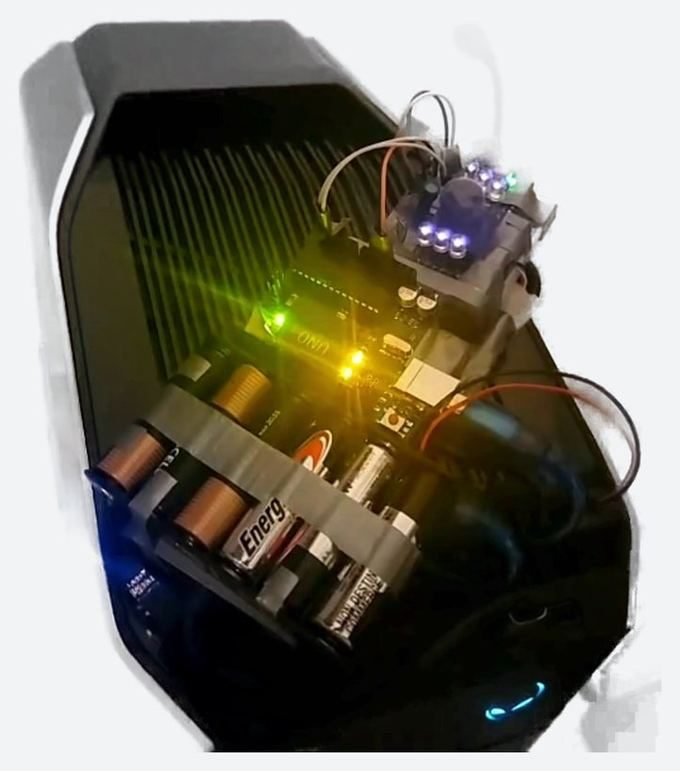
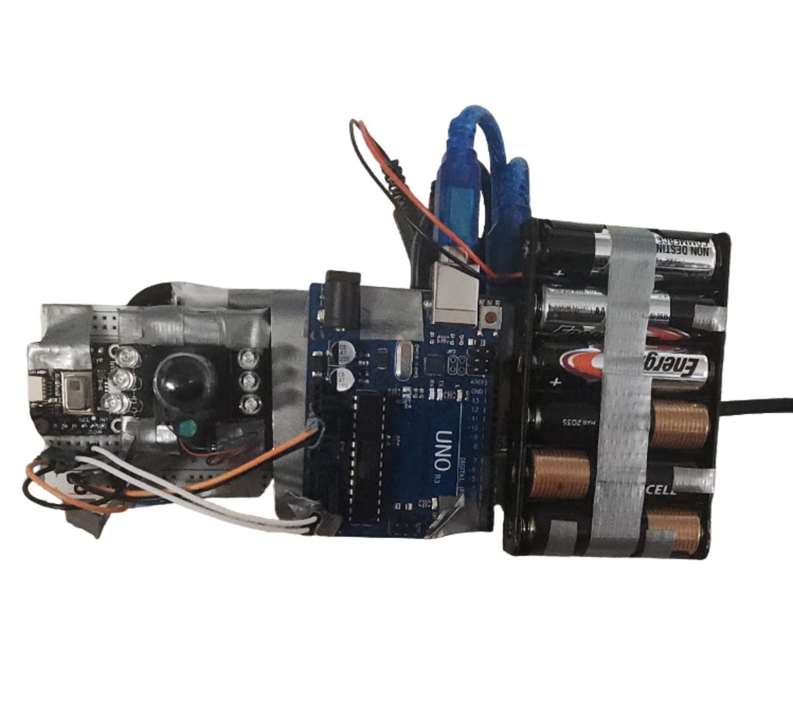

# Mobil-Eyes

A vehicle-mounted thermal + night-vision attachment that gives a driver a second view of the road in fog, rain, and darkness. It supplements the driver's eyes. It does not steer, brake, or replace them.

**EDD (Engineering Design & Development) capstone, 2025–26** · 2-person team with Daksha Srinivasan · presented to engineers at Garver

[Project page](https://ahmedg-stack.github.io/projects/mobil-eyes.html) · [Firmware](firmware/EDD_FinalProject_Code/EDD_FinalProject_Code.ino)

<p align="center">
  
  <br><em>Road test: camera feed and thermal map side by side on the in-cabin laptop.</em>
</p>

<p align="center">
  <a href="docs/media/demo-clip.mp4"></a>
</p>

▶ [Demo video](docs/media/demo-clip.mp4) (8 s loop): *a hand moves in front of the unit in a dark room. The night-vision feed shows it under IR light, and the thermal feed shows it as a heat signature at the same time.*

---

## My role

- Wrote the Arduino firmware that reads the AMG8833 over I²C and streams frames over USB serial.
- Soldered the AMG8833 and wired the UNO, sensor, and camera into one USB path.
- Built and mounted the housing and ran the road tests with my teammate.

**Daksha Srinivasan** was my teammate. <!-- TODO: add one line on Daksha's role — confirm with Ahmed -->

## System diagram



```
AMG8833 (8x8 thermopile) --I2C--> Arduino UNO R3 --USB serial, 115200 baud--+
                                                                            +--> USB-A to USB-C adapter --> USB-C extension --> laptop (browser web app)
Arducam 1080P USB night-vision camera --USB (UVC video)---------------------+
AA battery pack (in the housing)
```

## Parts list

| Part | Purpose |
|---|---|
| Arduino UNO R3 | Reads the thermal sensor, streams frames over serial |
| Adafruit AMG8833 8×8 thermal sensor | Heat-signature detection (64 pixels per frame, I²C) |
| Arducam 1080P USB night-vision camera | Visible + IR night vision |
| 3D-printed PLA housing | Holds both cameras on one forward axis |
| Breadboard + jumper wiring | Sensor-to-UNO connections |
| USB-A to USB-C adapter | Combines both devices onto one cable |
| USB-C extension | Runs from the outside of the car into the cabin |
| AA batteries | Power inside the housing |

## How it works

**Firmware ([`EDD_FinalProject_Code.ino`](firmware/EDD_FinalProject_Code/EDD_FinalProject_Code.ino)).** This is the code I wrote and own.

1. Opens serial at **115200 baud** and starts the AMG8833 with the Adafruit library.
2. If the sensor doesn't respond, it prints a wiring hint and halts instead of streaming garbage.
3. Each loop reads all 64 pixels in one I²C read and prints them as an **8×8 grid** of °C values (8 values per line).
4. Ends each frame with a **`---`** line so the receiver can find frame boundaries.
5. Waits **50 ms** before the next frame.

Example output for one frame:

```
22.75, 23.00, 22.50, ... (8 values)
... (8 lines total)
---
```

**Web app (not in this repo).** A browser-based web app read the serial stream, drew the thermal grid as a heat map, and showed it next to the Arducam feed. It could switch between the thermal and camera views. The web app was built with AI assistance, and its source code was lost after the project. It is **not** included or recreated here. The firmware and hardware integration are my work.

**Arducam day/night.** The camera's switch between day and night mode is a built-in preset of the Arducam module, not an algorithm we wrote.

## Design iterations



| Iteration | Idea | Why it changed |
|---|---|---|
| 1 | Rotating roof turret for 360° coverage | Motor lag, motion blur, and weather wear added failure points |
| 2 | Four dual-camera sets (8 cameras) around the car | Eight feeds through one USB hub and one UNO was a data bottleneck |
| 3 (built) | One forward-facing unit: thermal + night vision | Focuses on the path in front of the car, where visibility matters most |

**Wi-Fi → wired USB.** We first streamed over Wi-Fi to keep cables off the car. The wireless link added about **2 s** of lag, which is far too slow for a moving car, so we switched to a hardwired USB cable routed around the car frame into the cabin.

**Phone → laptop.** The web app ran on phones, but not reliably: phones restrict external USB devices from sending input, as a security measure, so the same setup didn't always connect. We moved to a laptop for testing. Running in a browser on a computer also leaves room to integrate later with in-car systems such as Apple CarPlay or Android Auto.

**Mounting.** We designed a clamp mount (below), but the tested unit was attached with industrial adhesive instead.

<p>
  
  
  
</p>

## Build

<p>
  
  
  
</p>

- **Soldering failure.** On the first attempt I overheated the AMG8833 while soldering and destroyed it. I replaced the sensor and changed my technique (temperature and contact time) to protect the sensor.
- **Vibration.** Breadboard jumper wires shook loose during test drives. We secured them with adhesive and tighter cable management inside the housing.

## Testing and results

We measured camera response time, checked visual depth range and sensor precision, and tested manual and automatic view switching.

- The system worked reliably when stationary and at low speed.
- **Above ~20 mph** the display lagged behind the car's real position too much to be useful. The bottleneck was the processing and display pipeline (Arduino → USB → web app), not the cable.
- Worked: the USB adapter connected universally, the cameras responded consistently, the night-vision camera produced usable images in the dark, and the web-app display stayed up through testing.
- Fell short: the unit was bulkier than planned, and our budget limited camera range and precision.

## Limitations

- **Range.** The AMG8833's rated detection range for a human is about **7 m**. The demo proves the detection principle, not highway-distance detection.
- **Latency above ~20 mph** is still an open problem.
- **Resolution.** 8×8 thermal pixels show that something warm is there, not what it is.
- **Wired only.** The cable limits where the unit can be mounted.
- **Web app source lost.** The display side can't be rebuilt from this repo.

## What I'd do next

- Replace the UNO with a faster processor (for example a Raspberry Pi or Jetson Nano) to cut processing time.
- Move from a breadboard to a custom PCB to eliminate loose wires.
- Try a low-latency wireless or high-speed wired link.
- Upgrade the thermal sensor's range and resolution; consider adding LiDAR for distance.

## Repo contents

```
firmware/EDD_FinalProject_Code/EDD_FinalProject_Code.ino   Arduino sketch (UNO R3 + AMG8833)
docs/images/                                              Diagrams, CAD renders, build and test photos
docs/media/demo-clip.mp4                                  8 s detection demo
```

To build the firmware: Arduino IDE → install **Adafruit AMG88xx Library** → board **Arduino Uno** → upload. Open the Serial Monitor at 115200 baud.

## Credits

- **Daksha Srinivasan**, teammate
- Mentors: **Bryan Mueller** (CompEdge), **Dr. Sriram Chandrasekaran** (Raytheon), **Edgar Nunez** (CTE Center)
- **Garver**, for the opportunity to present
- Classmates, for peer reviews

## License

Firmware: [MIT](LICENSE).
